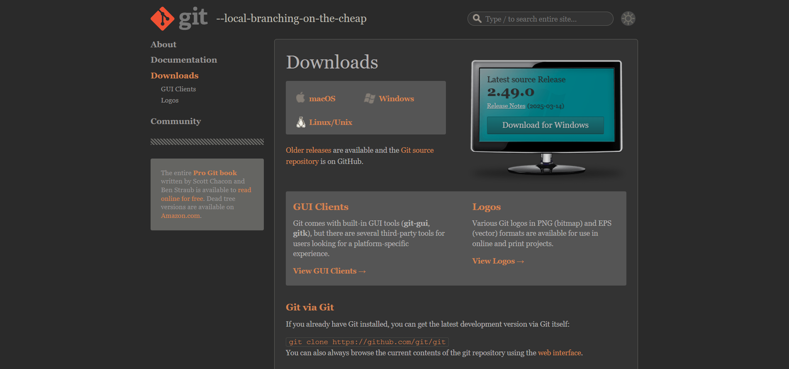
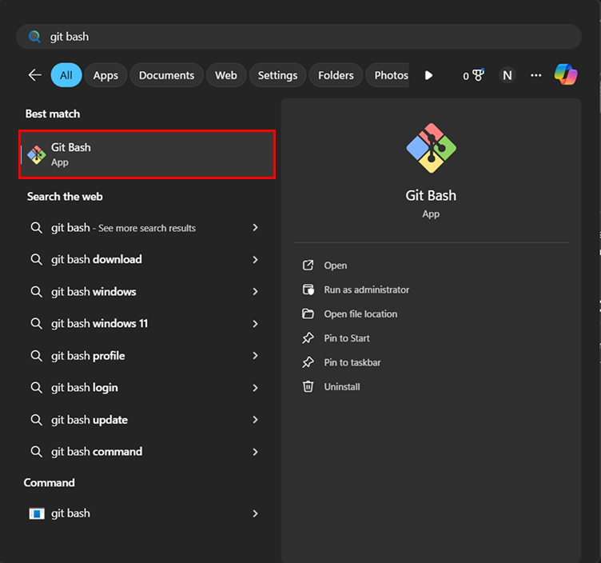
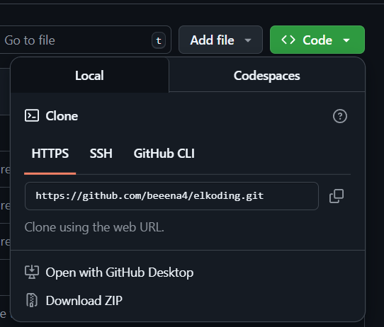
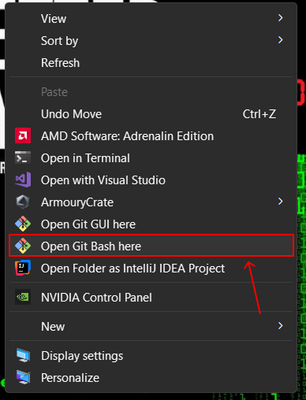
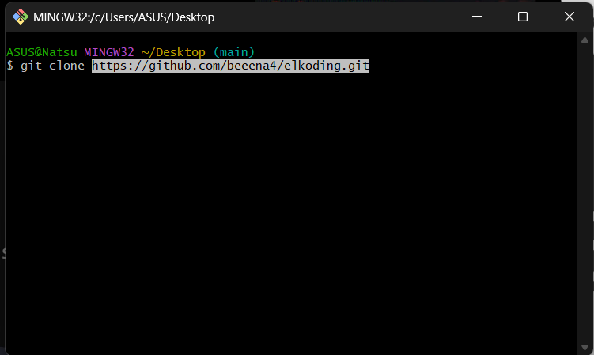
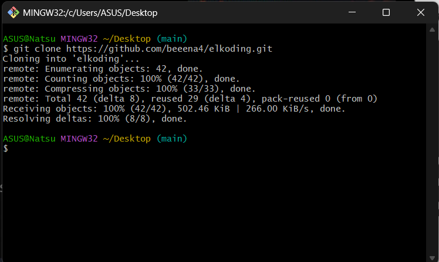

# elkoding


# Download git bash

 <div align="center">
 
</div>

pastikan anda sudah mendownload git bash terlebih dahulu sebelum mengikuti tutorial dibawah ini. kalian bisa kunjungi website resmi [`git bash`]( https://git-scm.com/downloads) atau link dibawah ini, lalu unduh sesuai OS kalian.

 ```
   https://git-scm.com/downloads
 ```

 <div align="center">
 
</div>

# Configure your Git
Untuk mengonfigurasi nama pengguna dan alamat email Git kamu secara global, gunakan perintah berikut di terminalmu (atau langsung diterminal git bash):
1. cari aja di windows `git bash`

<div align="center">
 
</div>

2. ketik aja perintah ini
   ```sh
   git config --global user.name "YOUR_NAME"
   git config --global user.email "YOUR_EMAIL@example.com"
   ```

   nah ganti `YOUR_NAME` dengan username github kalian dan ganti `YOUR_EMAIL@example.com` menggunakan email yang kalian pake di github.
# How to Clone Repositori
Untuk clone repositori, bisa salin ini:
   ```sh
   git clone https://github.com/beeena4/elkoding
   ```

   `Hanya contoh`
atau click button berwarna hijau bertuliskan `code` lalu salin yang di `HTTPS`

<div align="center">
 
</div>

### Langkah-langkah lengkap:
1. Buka terminal atau Git Bash (saranku pake git bash).
2. Click kanan pada folder tempat kamu ingin menyimpan repositori.
3. Cari pilihan `Show more options` berada dipaling bawah.
<div align="center">
 
</div>

4. Lalu Cari pilihan `Open Git Bash here`, maka nanti akan masuk ke terminal bash nya.
<div align="center">
 
</div>

5. Jalankan perintah `git clone` seperti di atas di ikuti dengan link repositori github.
   ```sh
   git clone https://github.com/beeena4/elkoding
   ```

   `Hanya contoh`
<div align="center">
 
</div>

6. Nah, untuk paste nya bisa click kanan lalu paste trus enter dah, nanti bakal memproses seperti dibawah ini.

<div align="center">
 
</div>

7. Selamat !!! repositori berhasil di clone lalu periksa apakah folder repositori sudah ada !!! `(Normalnya di dekstop)`
8. Tinggal buka aja di editor code atau Vs code.

# git commit & push ke github
git commit adalah perintah Git yang digunakan untuk menyimpan perubahan pada repositori lokal setelah perubahan tersebut telah disiapkan (di-stage) menggunakan perintah git add. `(jangan lupa tiap selesai ngoding pastikan save dlu atau ctrl s biar kesimpen)`
### ✅ Langkah-langkah Melakukan Commit
#### 1. Cek Status
   Lihat perubahan yang belum di-commit, ketik ini di terminal:
   ```
   git status
   ```
#### 2. Pilih File untuk Di-commit
   Tambahkan file yang ingin di-commit:
   ```
   git add <nama-file>
   ```
   atau semua file:
   ```
   git add .
   ```
#### 3. Gunakan Format Semantic Commit `(opsional)`
   Lakukan commit dengan pesan yang jelas dan terstruktur `(btw ini opsional ya)`.
   example :
   ```
   git commit -m "feat: tambah fitur pencarian mahasiswa"
   ```
   buat yg mau tau format semantic commit bisa kujungi link ini
   ### 📌 Format Semantic Commit:
 [`semantic-commit-messages.md`](https://gist.github.com/joshbuchea/6f47e86d2510bce28f8e7f42ae84c716)
---
   ### 🚀 Push ke GitHub:
   cukup ketik ini setelah berhasil commit:
   ```
   git push origin main
   ```
 `(Ganti main jika kamu pakai branch lain)`

# 🔄 git pull
git pull digunakan untuk mengambil (fetch) perubahan terbaru dari repository GitHub dan langsung menggabungkannya (merge) ke branch lokal kamu.

#### 1. Gunakan Perintah Git Pull
   cukup ketik ini diterminal:

   ```
   git pull origin main
   ```
   Ganti main jika branch-mu bernama lain (misalnya: master, dev, dll).

   atau bisa langsung:

   ```
   git pull 
   ```

# ⚠️ Tips:
Selalu lakukan `git pull` sebelum `git push`, agar konflik bisa dihindari.

---
___
# Abaikan bawah ini!!!
---
# TUTORIAL MERGE BRANCH
1. Pastikan clone repository dari git ke lokal 💻
   ```sh
   git clone https://github.com/beeena4/elkoding.git
   ```
2. Periksa Semua Branch
   ```sh
   git branch -a
   ```
3. Pindah ke Branch Target (Misalnya main)
   ```sh
   git checkout -b main
   ```
4. Pastikan branch target sudah up-to-date
   ```sh
   git push origin main
   ```